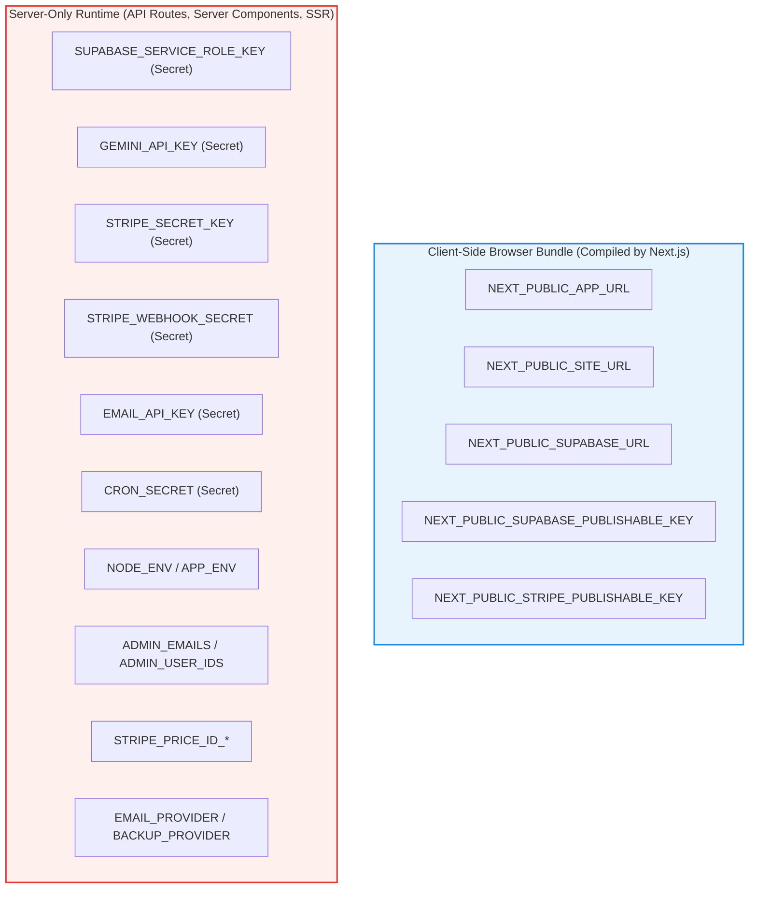

# Environment Setup Status — TaxAIHelp

**Date:** October 1, 2026  
**Status:** COMPLETE & ARCHITECTURALLY RECONCILED  
**Associated Audit:** [PRODUCTION-ENV-AUDIT.md](file:///e:/USA%20TAX%20Project/PRODUCTION-ENV-AUDIT.md)  
**Configuration Templates:** [.env.example](file:///e:/USA%20TAX%20Project/.env.example), [docs/ENVIRONMENT-VARIABLES.md](file:///e:/USA%20TAX%20Project/docs/ENVIRONMENT-VARIABLES.md)  

---

## 1. Summary of Changes

Following the static production environment audit, the environment configuration templates have been updated to achieve 100% parity with actual codebase `process.env` references:

1. **Reconciled `.env.example`:** Added all 8 previously missing variables with safe placeholders:
   - `NEXT_PUBLIC_APP_URL` (Canonical HTTPS base URL)
   - `SUPABASE_SERVICE_ROLE_KEY` (Server-only administrative Supabase key)
   - `APP_ENV` (Explicit environment override for staging/production)
   - `ADMIN_EMAILS` (Server-side super-admin bootstrap accounts)
   - `ADMIN_USER_IDS` (UUID-based admin authorization list)
   - `STRIPE_PRICE_ID_PROFESSIONAL_ANNUAL` (Annual price ID for professional tier)
   - `BACKUP_PROVIDER` (Backup transport identifier: `null` or `supabase`)
   - `CRON_SECRET` (Bearer token for scheduled maintenance routes)
2. **Clear Section Separation:** Categorized `.env.example` into:
   - Public / Browser-Safe Variables (`NEXT_PUBLIC_*`)
   - Server-Only Secrets (Never prefixed with `NEXT_PUBLIC_`)
   - Runtime Environment & Authorization
   - Stripe Subscription Price IDs
   - Optional & Feature-Dependent Configuration
3. **Updated Documentation:** Aligned `docs/ENVIRONMENT-VARIABLES.md` with complete Stripe subscription price IDs and secret protection invariants.

---

## 2. Environment Classification & Security Boundaries



---

## 3. Quickstart: Local Development Setup

To initialize a local development environment:

```bash
# 1. Copy the example template to a local private file
cp .env.example .env.local

# 2. Run the development server
npm run dev
```

### Safe Local Development Invariants:
- **No live API keys required:** The application operates out-of-the-box with full deterministic calculation capabilities.
- **Supabase unconfigured fallback:** Uses built-in in-memory stores for profiles, sessions, and leads.
- **Gemini unconfigured fallback:** Uses built-in deterministic contextual tax explanation engine.
- **Stripe unconfigured fallback:** Operates in mock checkout and staging mode.
- **Email unconfigured fallback:** In-app notification center remains fully functional with `EMAIL_PROVIDER=null`.

---

## 4. Production Deployment Checklist (Vercel)

Prior to production deployment, configure the following secrets in the hosting dashboard (e.g. Vercel Project Settings > Environment Variables):

| Key | Value Source | Security Note |
| :--- | :--- | :--- |
| `NEXT_PUBLIC_APP_URL` | `https://taxaihelp.com` | Production canonical domain (HTTPS required). |
| `NEXT_PUBLIC_SITE_URL` | `https://taxaihelp.com` | Public SEO and metadata base URL. |
| `NEXT_PUBLIC_SUPABASE_URL` | Supabase Dashboard > Project Settings > API | Public API gateway URL. |
| `NEXT_PUBLIC_SUPABASE_PUBLISHABLE_KEY` | Supabase Dashboard > Project Settings > API | Public anon key (enforced with Row Level Security). |
| `SUPABASE_SERVICE_ROLE_KEY` | Supabase Dashboard > Project Settings > API | **SECRET:** Never expose to client. |
| `GEMINI_API_KEY` | Google Cloud Console > Credentials | **SECRET:** Server-side AI explanation key. |
| `STRIPE_SECRET_KEY` | Stripe Dashboard > Developers > API keys | **SECRET:** Live secret key (`sk_live_...`). |
| `STRIPE_WEBHOOK_SECRET` | Stripe Dashboard > Developers > Webhooks | **SECRET:** Webhook signing secret (`whsec_...`). |
| `NEXT_PUBLIC_STRIPE_PUBLISHABLE_KEY` | Stripe Dashboard > Developers > API keys | Public publishable key (`pk_live_...`). |
| `STRIPE_PRICE_ID_*` | Stripe Dashboard > Products > Pricing | Live subscription price IDs. |
| `ADMIN_EMAILS` | Internal security policy | Verified admin email addresses for role elevation. |
| `NODE_ENV` / `APP_ENV` | Platform / `production` | Production environment tags. |
| `CRON_SECRET` | Random 32-character string | Secures scheduled maintenance endpoints. |

---

## 5. Modified Files

| File | Changes Made |
| :--- | :--- |
| [.env.example](file:///e:/USA%20TAX%20Project/.env.example) | Added 8 missing variables with safe placeholders; separated into 5 clear sections. |
| [docs/ENVIRONMENT-VARIABLES.md](file:///e:/USA%20TAX%20Project/docs/ENVIRONMENT-VARIABLES.md) | Added Stripe Price ID variables to inventory table. |
| [ENV-SETUP-STATUS.md](file:///e:/USA%20TAX%20Project/ENV-SETUP-STATUS.md) | Created summary status, classification diagram, and setup quickstart. |
