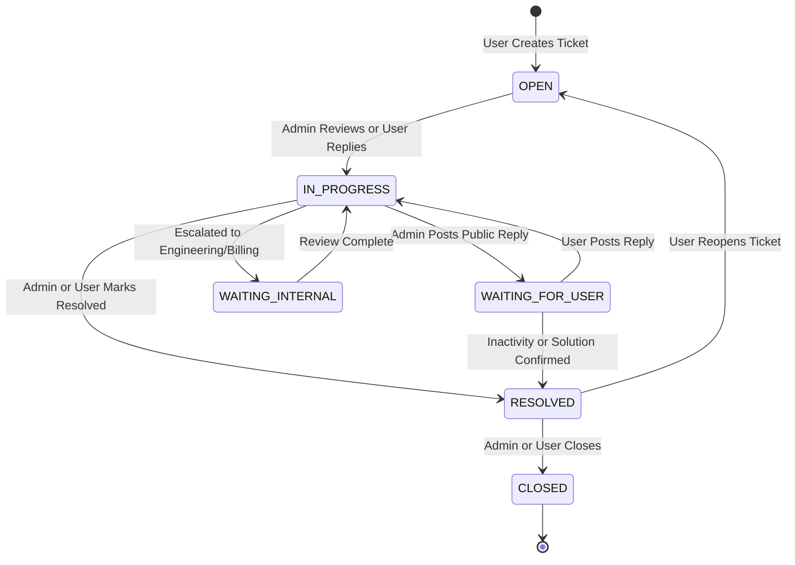

# TaxAIHelp Production Support Center & Issue Reporting Architecture

**Phase 5 — Step 16**  
**Document Version:** 1.0.0  
**Effective Date:** September 2026  
**Status:** Production Ready

---

## 1. Executive Summary & Objective

The TaxAIHelp Support Center provides an end-to-end, privacy-hardened support, issue-reporting, feedback, and ticket-management platform for taxpayers and administrative staff.

The system empowers authenticated taxpayers to:
- Contact support, report bugs, ask account and billing inquiries, submit feedback, or request features.
- Report tax engine calculation discrepancies or AI Assistant issues with strictly minimal safe context.
- Report security disclosures and privacy/data requests through dedicated escalation channels.
- Track submitted request lifecycle, inspect safe metadata, and post conversation replies.
- Receive safe in-app and transactional email updates containing zero sensitive financial details.

The system empowers system administrators to:
- Monitor live ticket queues with multi-dimensional filtering (category, status, priority, assignment).
- Search tickets by human-readable reference number (`TAH-YYYY-NNNNNN`), subject, or user email.
- Assign tickets to staff members, update status transitions, and escalate priorities.
- Post public replies to users and record private internal operational notes.
- Inspect safe context (calculation ID, tax year, filing status, engine version) without duplicating tax dollars.
- Maintain an immutable administrative audit trail for compliance and operational governance.

---

## 2. Critical Privacy Invariant

TaxAIHelp handles sensitive federal taxpayer financial information. The Support Center is designed to operate strictly as an operational customer care layer, **NOT** as a secondary tax calculation database.

### 2.1 Strictly Prohibited Support Data
Under no circumstances does the support subsystem store, duplicate, or expose:
- Social Security Numbers (SSNs) or Individual Taxpayer Identification Numbers (ITINs)
- Employer Identification Numbers (EINs)
- Bank account numbers, routing transit numbers, or wire details
- Credit card numbers, expiration dates, or CVV codes
- Authentication passwords, JWTs, or session tokens
- Supabase service-role keys, Stripe secrets, or Gemini API keys
- Full tax calculation input/output snapshots
- Complete conversational transcripts with the AI Assistant
- Dollar figures for W-2 wages, 1099 gross earnings, tax liabilities, or refund amounts

### 2.2 Minimal, Purpose-Based Safe Context
When a user or automated action links a support ticket to an existing calculation or report, only non-sensitive metadata references are stored:
- `calculationId`: UUID reference to the calculation record
- `calculatorType`: `income_tax` | `self_employed` | `1099` | `quarterly_tax`
- `taxYear`: Numeric tax year (e.g. 2025, 2026)
- `filingStatus`: `Single` | `Married Filing Jointly` | `Head of Household` | etc.
- `engineVersion`: Deterministic engine build identifier (e.g. `1.0.0`)
- `rulesVersion`: Statutory tax rules version (e.g. `2026.1`)
- `reportId`: Optional reference to a generated report summary
- `conversationId`: Optional reference to an AI assistant session

Support administrators needing to inspect actual financial numbers must open the existing privileged calculation tools governed by full audit logging.

---

## 3. Data Models & Lifecycle

### 3.1 Support Ticket Model
```typescript
interface SupportTicket {
  id: string; // UUID primary key
  ticketNumber: string; // Human-readable e.g. TAH-2026-000101
  userId: string; // Owner UUID
  userEmail?: string;
  userName?: string;
  subject: string; // 5-160 characters
  category: SupportCategory;
  priority: SupportPriority;
  status: SupportStatus;
  assignedAdminId?: string | null;
  assignedAdminName?: string | null;
  safeContext?: SupportTicketSafeContext;
  rating?: number | null; // Optional 1-5 feedback rating
  createdAt: string;
  updatedAt: string;
  lastMessageAt: string;
  resolvedAt?: string | null;
  closedAt?: string | null;
}
```

### 3.2 Human-Readable Ticket Numbering
Public ticket identifiers are generated server-side using the format:
$$\text{TAH}-\text{YYYY}-\text{NNNNNN}$$
*(e.g., `TAH-2026-000101`)*. Sequential internal database IDs are never exposed directly to users or external clients.

### 3.3 Support Message Model & Internal Note Isolation
```typescript
interface SupportMessage {
  id: string; // UUID
  ticketId: string; // Foreign key to support_tickets
  authorUserId: string;
  authorType: "USER" | "ADMIN" | "SYSTEM";
  authorName?: string;
  body: string; // 1-5000 characters, strictly sanitized plain text
  isInternal: boolean; // CRITICAL: Internal operational notes
  createdAt: string;
  updatedAt: string;
}
```

#### Strict Isolation of Internal Notes
- **User APIs**: Completely omit any message where `is_internal = true`.
- **User Notifications**: Internal notes never trigger email or in-app alerts.
- **Data Export**: Internal notes are strictly excluded from GDPR/CCPA account export packages.
- **Audit Logs**: Record that an internal note was added without recording the message body.

### 3.4 Status Workflow & Allowed Transitions

- Users are permitted to close their own tickets or reopen tickets in `RESOLVED` status.
- Users cannot mutate admin assignments, priority, or transition tickets into arbitrary intermediate states.

### 3.5 Categories
1. `ACCOUNT`: Login, profile preferences, email verification.
2. `BILLING`: Subscriptions, upgrades, receipts, payment failure.
3. `CALCULATOR`: Calculator input usability and guidance.
4. `TAX_CALCULATION`: Tax engine formula queries or statutory bracket questions.
5. `AI_ASSISTANT`: Questions regarding AI conversational explanations.
6. `REPORT`: Questions or formatting issues with generated tax summary reports.
7. `PROFESSIONAL_HANDOFF`: Inquiries regarding CPA/EA consultation requests.
8. `BUG`: Technical defects or platform errors.
9. `FEATURE_REQUEST`: Feedback requesting new tax forms or capabilities.
10. `FEEDBACK`: Qualitative user ratings (1–5 stars) and comments.
11. `SECURITY`: Responsible security disclosures and vulnerability reports.
12. `PRIVACY`: Data privacy questions, deletion inquiries, and compliance.
13. `OTHER`: General inquiries not falling into the above categories.

### 3.6 Priority Management
- `LOW`: General feedback, informational queries.
- `NORMAL`: Default for user-submitted inquiries.
- `HIGH`: Time-sensitive calculation questions or payment blocks. Automatically escalated for `SECURITY` and `PRIVACY` categories.
- `URGENT`: Critical security findings, service blocks. Users cannot arbitrarily create `URGENT` tickets unless escalated by staff or designated security triage.
- **Target Response Guidance**: Guidance shown to users reflects operational target times, never guaranteed SLA numbers.

---

## 4. Security & Validation Architecture

### 4.1 Input Validation & Anti-XSS Sanitization
- All text inputs (`subject`, `description`, `body`, `internal notes`) pass through strict Zod bounds checking:
  - `subject`: 5 to 160 characters.
  - `description` / `body` / `note`: 1 to 5,000 characters.
- Text is sanitized via `sanitizeSupportText`:
  - Strips `<script>`, `<style>`, `<iframe>`, and arbitrary `<[^>]+>` HTML tags.
  - Neutralizes `javascript:` pseudo-protocols.
  - Removes inline event handlers (`onclick=`, `onerror=`).
- Display layers render message bodies as safe plain text with `whitespace-pre-wrap` styling, completely avoiding `dangerouslySetInnerHTML`.

### 4.2 Rate Limiting & Abuse Prevention
- **Ticket Creation Rate Limit**: 5 new tickets per 15-minute sliding window per authenticated user.
- **Message Reply Rate Limit**: 15 messages per 10-minute sliding window per authenticated user.
- Exceeding limits returns a standardized `RATE_LIMIT_ERROR` (HTTP 429) without leaking internal counter structures.

### 4.3 Row Level Security (RLS) Policies
PostgreSQL RLS is enabled on `public.support_tickets` and `public.support_messages`:
- **`support_tickets_select_user`**: `auth.uid() = user_id`
- **`support_tickets_insert_user`**: `auth.uid() = user_id`
- **`support_tickets_update_user`**: `auth.uid() = user_id`
- **`support_tickets_admin_all`**: Verified admin role full access.
- **`support_messages_select_user`**: `is_internal = false AND ticket.user_id = auth.uid()`
- **`support_messages_insert_user`**: `is_internal = false AND author_type = 'USER' AND ticket.user_id = auth.uid()`
- **`support_messages_admin_all`**: Verified admin role full access (including internal notes).

---

## 5. System Integrations

### 5.1 Account Export Integration
When a user initiates an account export via `AccountDataService.exportUserData(userId)`:
- Includes user-owned support tickets and user-visible messages (`isInternal = false`).
- Excludes administrative internal notes, admin-only audit records, staff usernames, and internal routing tags.

### 5.2 Account Deletion Integration
When a user exercises their right to account erasure via `AccountDataService.deleteUserData(userId)`:
- All support tickets and messages associated with `userId` are permanently purged from database and memory stores.
- The immutable security audit log records the account deletion event and the count of purged tickets without logging message bodies.

### 5.3 Notification Architecture Integration
- **Ticket Created**: Dispatches an in-app confirmation notification.
- **Staff Reply Posted**: Dispatches an in-app alert and transactional email (if email enabled) containing a safe sanitized excerpt.
- **Status Changed / Resolved**: Dispatches in-app update notices.
- All email templates and notification text strictly omit tax figures, income amounts, refunds, or liabilities.

### 5.4 Platform Configuration & Feature Flags
- Governed by `support.enabled` platform feature flag:
  - When disabled, new ticket creation returns HTTP 503 (`FEATURE_DISABLED`) with a polite maintenance notice.
  - **Mandatory Escalation Exception**: `SECURITY` and `PRIVACY` ticket categories bypass maintenance mode to guarantee user compliance channels remain permanently available.

### 5.5 Observability & Structured Audit Logging
- **Metrics**:
  - `support_ticket_created_total`
  - `support_message_created_total`
  - `support_ticket_resolved_total`
  - `support_ticket_reopened_total`
  - `support_rate_limit_triggered`
  - `support_operation_blocked_total`
- **Audit Logs** (`AuditLogStore`):
  - `support_admin_reply`
  - `support_internal_note_added`
  - `support_ticket_status_changed`
  - `support_ticket_priority_changed`
  - `support_ticket_assigned`
  - `support_ticket_resolved`
  - All audit entries log `requestId`, `adminUserId`, `ticketNumber`, and operational action. Full message bodies are never recorded in audit metadata.
